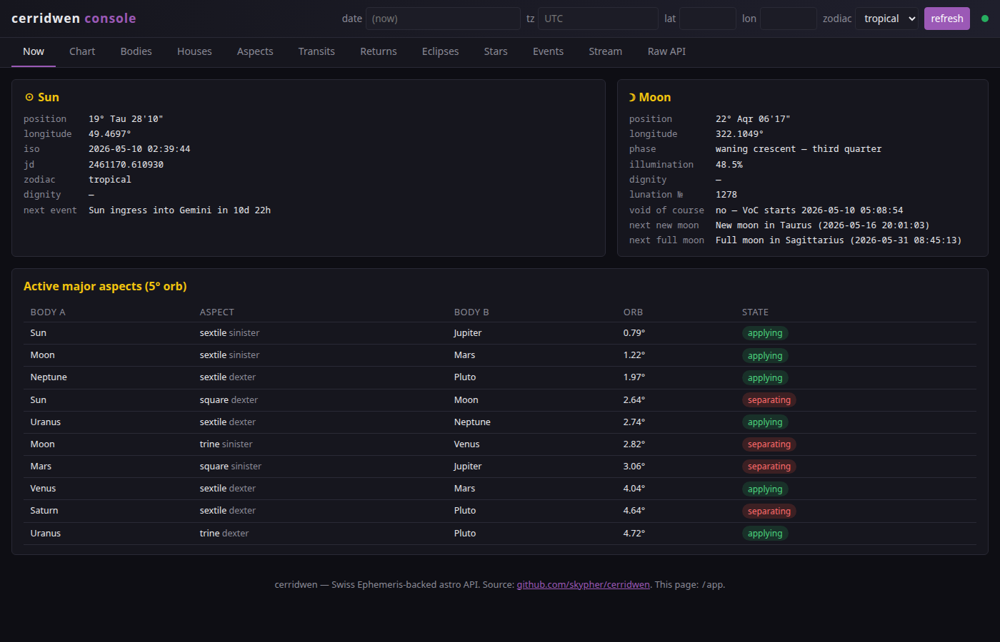
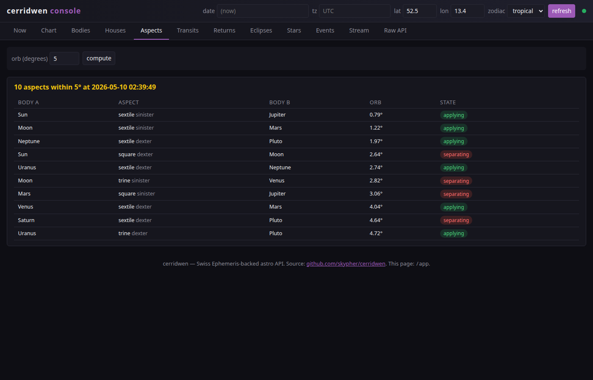

# Cerridwen documentation

Cerridwen is a geocentric astrology / astronomy API backed by Swiss
Ephemeris. It ships:

* a JSON HTTP server (`cerridwen-server`)
* a tabbed web console (`/app`) covering every endpoint
* a chart-wheel renderer (`/chart`)
* an MCP server (`cerridwen-mcp`) so LLM agents can call it as a tool
* a CLI (`cerridwen`) for one-shot queries

This directory holds the long-form docs. The [project README](../rust/README.md)
has the canonical endpoint table.

## Quickstart

```bash
git clone https://github.com/skypher/cerridwen
cd cerridwen
CERRIDWEN_EPHE_PATH=$(pwd)/sweph \
  cargo run --features server --bin cerridwen-server
# → http://127.0.0.1:2828/
```

## Pages

* [Five common tasks](five-common-tasks.md) — `curl` recipes for the
  most-asked questions: where is the Moon now, when is the next full
  moon, what's transiting my chart, etc.
* [Endpoint reference](endpoints.md) — every route, every query param.
* [Deployment](../deploy/README.md) — Docker, systemd, nginx,
  Prometheus.
* [Contributing](../CONTRIBUTING.md) — pre-commit hook, style, scope.

## Screenshots

`/app#now` — live Sun/Moon dashboard:



`/app#chart` — interactive chart wheel with aspect lines and ℞ markers:


`/app#aspects` — instantaneous aspect grid:


