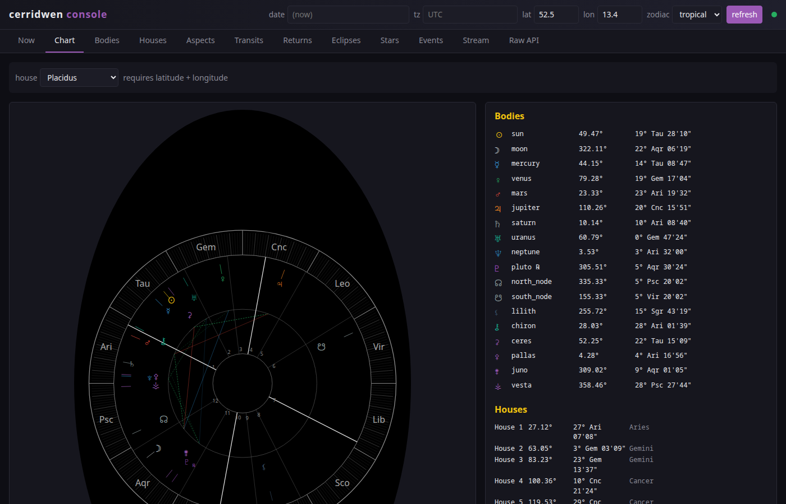

# cerridwen — Rust port

[](https://github.com/skypher/cerridwen/actions/workflows/ci.yml)


Geocentric Sun/Moon/planet data backed by Swiss Ephemeris.
A Rust port (and substantial superset) of the original Python `cerridwen`.



## Binaries

| binary                       | feature   | purpose                                                |
| ---------------------------- | --------- | ------------------------------------------------------ |
| `cerridwen`                  | (default) | CLI — prints sun/moon/lunation/VoC/next-event for now  |
| `cerridwen-server`           | `server`  | JSON HTTP API + web UI + SSE streams + OpenAPI + MCP   |
| `cerridwen-event-generator`  | `events`  | populates a sqlite events table                        |
| `cerridwen-mcp`              | `mcp`     | Model Context Protocol server over stdio for LLM tools |

```bash
cd rust
cargo build                                # lib + cli
cargo build --features server              # + HTTP server, OpenAPI, /docs, /chart, /app
cargo build --features events              # + sqlite event generator
cargo build --features mcp --bin cerridwen-mcp
cargo test                                 # unit + integration tests
```

## Running the server

```bash
CERRIDWEN_EPHE_PATH=$(pwd)/../sweph \
  cargo run --features server --bin cerridwen-server -- --port 2828
```

Then open http://127.0.0.1:2828/ for the web console, or hit any of the
JSON endpoints below directly.

The Swiss Ephemeris data files (`sepl_*.se1`, `seas_*.se1`, `sefstars.txt`)
are looked up at `./sweph` (cwd), then `../sweph`. Override with
`CERRIDWEN_EPHE_PATH`.

## HTTP API

| route                       | what                                                         |
| --------------------------- | ------------------------------------------------------------ |
| `GET /`                     | Web app (alias for `/app`)                                   |
| `GET /app`                  | Tabbed JS console — every feature in the browser             |
| `GET /chart`                | Standalone chart-wheel page                                  |
| `GET /docs`                 | Swagger / rapidoc UI                                         |
| `GET /openapi.json`         | OpenAPI 3.0 spec                                             |
| `GET /v1/sun`               | Sun position, dignity, rise/set, next-event                  |
| `GET /v1/moon`              | Moon position, phase, illumination, lunation №, void-of-course, new/full moon, rise/set |
| `GET /v1/body/{name}`       | Any of Sun..Pluto, lunar nodes, Lilith, Chiron, Ceres/Pallas/Juno/Vesta |
| `GET /v1/star/{name}`       | Fixed star (22 catalog entries: Sirius, Vega, Spica, …)      |
| `GET /v1/houses`            | 12 house cusps, ascendant, MC, vertex, etc., 18 systems      |
| `GET /v1/aspects`           | Instantaneous aspect grid between every pair of bodies       |
| `GET /v1/transits`          | Active transit-to-natal aspects                              |
| `GET /v1/return`            | Next solar/lunar/planetary return                            |
| `GET /v1/eclipses`          | Solar/lunar eclipse list with first/last contacts            |
| `GET /v1/midpoints`         | Pairwise midpoints plus 0/45/90/135/180 harmonic hits        |
| `GET /v1/antiscia`          | Antiscia and contra-antiscia positions plus chart hits       |
| `GET /v1/decans`            | Triplicity, Chaldean, and Egyptian decan assignments         |
| `GET /v1/terms`             | Ptolemaic or Egyptian bound ruler per body                   |
| `GET /v1/triplicity`        | Dorothean day/night/participating triplicity rulers          |
| `GET /v1/receptions`        | Mutual receptions by traditional domicile rulership          |
| `GET /v1/equation-of-time`  | Apparent solar time minus mean solar time, in minutes        |
| `GET /v1/ingresses`         | Upcoming cardinal-sign ingresses                             |
| `GET /v1/lunations`         | New, quarter, full, and last-quarter Moons in a window       |
| `GET /v1/heliacal/{star}`   | Next heliacal rising for a fixed star and observer           |
| `GET /v1/zodiacal-releasing`| Zodiacal Releasing L1 periods from the Lot of Spirit         |
| `GET /v1/natal-chart`       | Houses, bodies-with-houses, aspects, and Hellenistic lots    |
| `GET /v1/events`            | DB-backed astrological events (aspects/ingresses/retrogrades) |
| `GET /v1/events.ics`        | Same as above as an iCal feed (RFC 5545)                     |
| `GET /v1/olivier`           | Compact body positions in radians + houses                   |
| `GET /v1/stream/sun`        | SSE: pushes Sun position every `?interval=N` seconds         |
| `GET /v1/stream/moon`       | SSE: pushes Moon position every `?interval=N` seconds        |
| `GET /v1/stream/body/{name}`| SSE: pushes any body                                         |

### Common query parameters

- `date=2026-05-06T12:00:00` — ISO 8601 timestamp, or a Julian Day decimal
- `tz=Europe/Berlin` — IANA timezone for the ISO date (UTC if omitted)
- `latitude=52.5&longitude=13.4` — observer position; required for houses,
  rise/set, and the chart wheel
- `zodiac=tropical|sidereal` — defaults to tropical
- `ayanamsha=lahiri|krishnamurti|fagan_bradley|raman|yukteshwar|djwhal_khul|j2000|galactic_center|...`
  — picks the sidereal alignment when zodiac=sidereal
- `house_system=P|K|W|O|R|C|A|V|M|T|B|Y|X|H|N|D` or names
  (`placidus`, `koch`, `whole_sign`, …) — for `/v1/houses` and `/v1/olivier`
- `voc_traditional_only=1` — restrict Moon's void-of-course search to the
  seven traditional planets

### Caching

`cerridwen-server` ships a 10-second TTL response cache (replacing the
Python `MWT(timeout=10)`). Each response carries `X-Cache: HIT|MISS`.
Streams under `/v1/stream/*` bypass the cache.

## Web app (`/app`)

Tabbed single-page console covering every endpoint:

- **Now** — live Sun/Moon dashboard + active aspects (5° orb)
- **Chart** — interactive zodiac wheel with selectable house system,
  18 planets/points/asteroids
- **Bodies** — per-body lookup against `/v1/body/{name}`
- **Houses** — full table for any of 12 supported systems
- **Aspects** — instantaneous aspect grid with adjustable orb
- **Transits** — natal-vs-current aspects with applying/separating tags
- **Returns** — next solar/lunar/planetary return for any of 15 bodies
- **Eclipses** — filter by type (solar/lunar/both), lookahead, limit
- **Stars** — every star in the bundled catalog
- **Events** — DB-backed events table; "subscribe" button downloads the
  iCal feed
- **Techniques** — midpoint, antiscia, decan, term, triplicity, reception,
  ingress, lunation, heliacal, Zodiacal Releasing, and natal-chart calls
- **Stream** — live SSE position display via `EventSource`
- **Raw API** — generic GET console with X-Cache header echo, links to
  `/openapi.json` and `/docs`

Tabs are deep-linkable: `/app#aspects`, `/app#chart`, etc. Switching tabs
updates the URL hash; the back button restores the previous tab.

## MCP server

`cerridwen-mcp` speaks JSON-RPC 2.0 over stdio. Add to your Claude Code or
IDE MCP config:

```json
{
  "mcpServers": {
    "cerridwen": {
      "command": "/path/to/target/release/cerridwen-mcp",
      "env": { "CERRIDWEN_EPHE_PATH": "/path/to/sweph" }
    }
  }
}
```

Tools: `get_sun`, `get_moon`, `get_body`, `get_houses`, `get_aspects`,
`get_transits`, `get_return`, `get_eclipses`, `get_star`, `get_events`,
`get_declinations`, `get_stations`, `get_planetary_hours`,
`get_arabic_parts`, `get_profections`, `get_synastry`,
`get_progressions`, `get_prenatal_eclipse`, `get_twilight`,
`get_midpoints`, `get_antiscia`, `get_decans`, `get_terms`,
`get_triplicity`, `get_receptions`, `get_equation_of_time`,
`get_ingresses`, `get_lunations`, `get_zodiacal_releasing`, and
`get_natal_chart`.

## Library API

```rust
use cerridwen::{compute_moon_data, compute_sun_data, LatLong};

let observer = LatLong::new(52.5, 13.4).unwrap();
let moon = compute_moon_data(None, Some(observer));
println!("Moon: {} ({} illumination)",
         moon.position, (moon.illumination * 100.0) as i64);
println!("VoC: {}", moon.void_of_course.is_void);
```

Public re-exports include `Planet`, `Sun`/`Moon`/…/`Vesta`,
`Ascendant`, `FixedZodiacPoint`, `Body` trait, `compute_houses`,
`compute_transits`, `compute_aspects_at`, `next_eclipse`,
`eclipses_within_period`, `next_return`, `fixed_star`,
`parse_ayanamsha`, `compute_ayanamsha`, `apply_ayanamsha`,
`parse_house_system`, `valid_house_systems`,
`parse_jd_or_iso_date_in_tz`.

## Layout

- `src/lib.rs` — public API and aggregate `compute_*_data` fns
- `src/defs.rs` — constants, ephemeris-path resolution, per-thread `init_swe`
- `src/utils.rs` — JD↔ISO conversion, mod-360, time-zone parsing
- `src/approximate.rs` — recursive sample-and-refine event finder
- `src/planets.rs` — `Planet`, body wrappers, `Ascendant`,
  `FixedZodiacPoint`, eclipses, transits, aspects, returns, fixed stars,
  ayanamshas, houses
- `src/bin/cli.rs` — `cerridwen` CLI
- `src/bin/server.rs` — `cerridwen-server`
- `src/bin/event_generator.rs` — `cerridwen-event-generator`
- `src/bin/mcp.rs` — `cerridwen-mcp`
- `tests/numerical.rs` — port of `cerridwen/tests.py`
- `tests/features.rs` — coverage for nodes/asteroids, houses, ayanamshas,
  transits, eclipses, returns, stars, time zones
- `tests/mcp.rs` — protocol-level MCP smoke tests
- `../webapp/app.html` — the web console (embedded into the server via
  `include_str!`)
- `../chart/chart.html` — standalone chart wheel page (also embedded)
- `../sweph/` — Swiss Ephemeris data files (`sepl_*.se1`, `seas_*.se1`,
  `sefstars.txt`)

## Notes / gotchas

- **Per-thread sweph init**: the bundled libswisseph stores its globals
  (`swed`, including `swed.ephepath`) in `__thread`-local storage. Each
  tokio worker thread therefore needs its own `swe_set_ephe_path` call,
  gated by a `thread_local! Cell<bool>`. Without this, workers silently
  fall back to the Moshier formulae.
- **`next_sign_change` direction-aware**: a retrograde-moving body
  crosses the *previous* sign boundary next. The lunar mean node always
  regresses; without this the search never terminates.
- **`try_next_sign_change` returns `Option`**: very slow bodies near a
  station can have no sign change within the body's typical lookahead.
  The body endpoint and `next_event` both handle the `None` case
  gracefully.
- **Ephemeris drift**: ported tests match the Python reference to the
  second, except the 2020 Jupiter-Saturn conjunction (~3 s drift)
  attributable to precession-model differences between `pyswisseph` and
  `libswisseph-sys`.

## License

Cerridwen itself is MIT. Swiss Ephemeris is dual-licensed; the bundled
`libswisseph-sys` ships the AGPL-3.0 variant, so the combined binary is
AGPL-3.0 unless you license Swiss Ephemeris separately.
